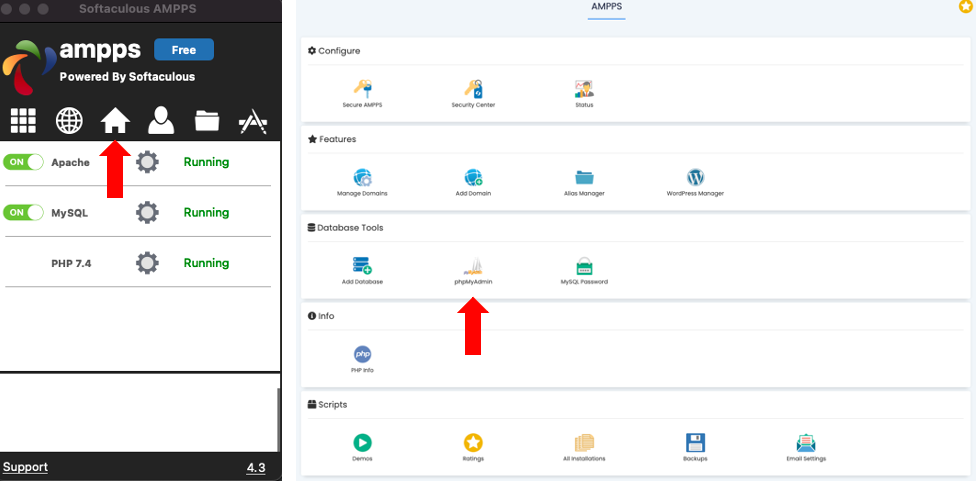
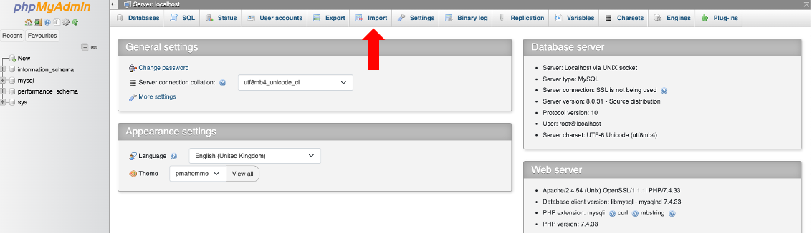

# Quick start

The platform can run on any AMPSS server. Easiest way to set it up locally is to download https://ampps.com/ which contains all the required packages. 

### Packages required
````
    - PHP 7.4
    - PostgreSQL
    - Python 3.9
    - Web Server e.g. Apache/Nginx
````

Install python dependencies 

```python
pip install -r requirements.txt
```

> Note you might have  to run pip3 if you're running python 3.x

# Database

Tables for the database can be created from the `create_db.sql` script. First we need to create a database called `user_db`. This is defined in `connect.php` where it can be changed.

### Create database
When using PostgresSQL command line, replace the `username` with your user. (The default user is `postgres`)

```bash
 bash -c "psql -U username postgres -c 'create database user_db;'"
```

Then run the script to create the tables

```bash
psql -d user_db -a -f path/to/file
```

### UI Alternative

Using [AMPSS](https://ampps.com/) launch PHP my Admin. First click on the home button in the AMPPS console, this will open a new window in your browser. Under the `Database Tools` section you can find phpMyAdmin.

Login with your credentials. (Defaults username is `root`, default password is `mysql`)



Find `Import`



Select the `create_db.sql` and import it. This will create a new database will all the required tables. 

> Note you will have to copy over the content of this repository to `www` directory on your web server. AMPPS software also has this directory, which is represented as a folder icon in the AMPPS console

# Admin

You will have  to create the admin user yourself, as the hashing function changes with different PHP verions. You can add an `admin` user into the `user` table and use [PHP password_hash generator](https://phppasswordhash.com/) to set a password. 

>  Admin page database connection relies on `sql_network_generator.py`, you will have to update `mydb` object to reflect your database credentials

In the Admin view you can select the round at the top of the page and configure your network with the menu on the left. 

# Secret key

> When registering, the participant has to provide a secret key, this is defined in `register.php` as `$validate_key_value_num` where you can change it. 

# Bots

The bots are connected to the database through `db_engine.py`, so you will have to define your credentials to database there. 

You have to manually add bot users to the `users` table. Once done you add new line in the `run_ai.sh` script e.g ``python3 main.py example_user``. 
Add multiple lines for more bots e.g.

```
python3 main.py example_user &
python3 main.py bot1 &
python3 main.py average_joe &
python3 main.py ma120 &
```

> Note that bots are not ran automatically, you have to start them manually or add them to `start_game.php` using `shell_exec`

